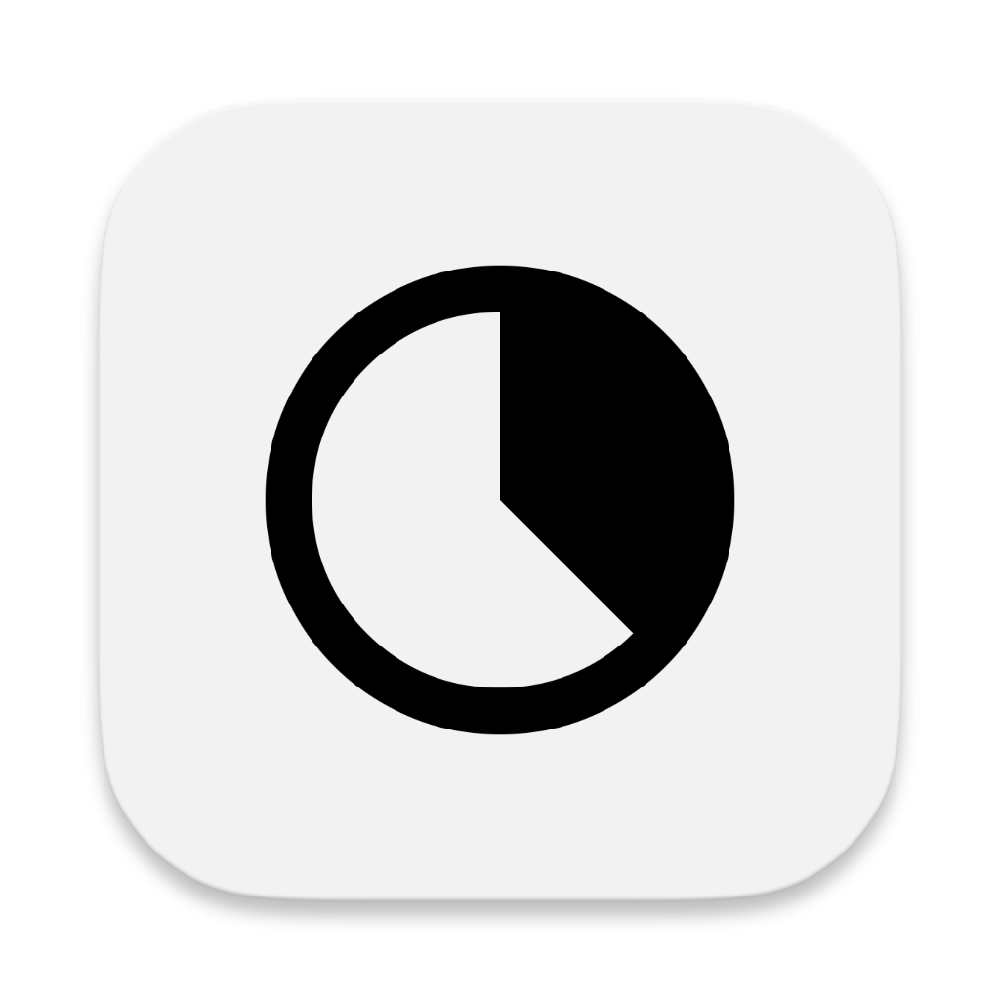
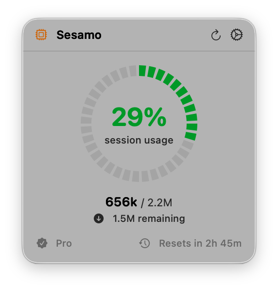
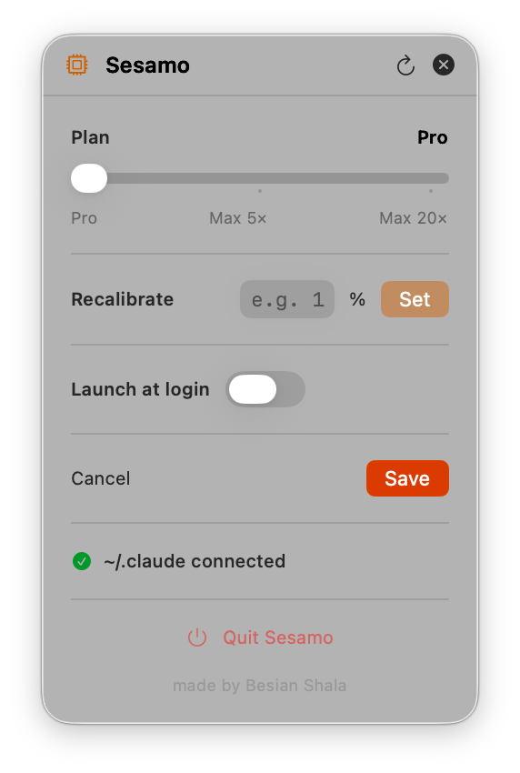

# Sesamo

<p align="center">
  
</p>

<p align="center">
  A lightweight macOS menu bar app to track your <a href="https://claude.ai/code">Claude Code</a> token usage in real time.
</p>

<p align="center">
  
  
  
</p>

---

## Overview

**Sesamo** sits quietly in your macOS menu bar and shows you exactly how many tokens you've used in the current Claude Code session — so you always know how much budget you have left before the next reset.

No browser tab, no manual counting. Just open the menu bar widget and see your usage at a glance.

---

## Screenshots

<p align="center">
  
  &nbsp;&nbsp;
  
</p>

---

## Features

- **Live token counter** — shows the exact number of tokens used and the session limit (e.g. 325k / 1.5M), reading directly from `~/.claude` with no extra configuration
- **Session progress ring** — circular gauge that fills up as you consume tokens, so you can see your usage at a glance without reading any numbers
- **Tokens remaining** — exact count of tokens left before the session resets
- **Reset countdown** — shows the exact time until your session window refreshes
- **Plan awareness** — displays your current Claude plan (e.g. Pro)
- **Launch at login** — optionally start Top Code automatically when you log in
- **Lightweight** — pure Swift, no Electron, minimal memory footprint

---

## Requirements

- macOS 13 Ventura or later
- An active [Claude Code](https://claude.ai/code) installation (the app reads from `~/.claude`)

---

## Installation

### Option 1 — Download the release (recommended)

1. Go to the [**Releases**](../../releases) page
2. Download the latest `Sesamo.dmg`
3. Open the DMG and drag **Sesamo** into your `/Applications` folder
4. Launch the app — it will appear in your menu bar

> **First launch on macOS:** if you see a Gatekeeper warning, go to **System Settings → Privacy & Security** and click **Open Anyway**.

### Option 2 — Build from source

```bash
git clone https://github.com/besianshala23/sesamo.git
cd sesamo
open Sesamo.xcodeproj
```

Then build and run the project from Xcode (`⌘R`).

---

## How It Works

Sesamo reads the usage data that Claude Code writes locally to `~/.claude`. It parses token counts, calculates your session percentage, and refreshes the display automatically. No internet connection is required, and no data is ever sent anywhere — everything stays on your machine.

---

## Contributing

Contributions are welcome! Here's how to get started:

1. **Fork** this repository
2. **Create a feature branch**: `git checkout -b feature/your-feature-name`
3. **Commit your changes**: `git commit -m "Add: short description"`
4. **Push** to your fork: `git push origin feature/your-feature-name`
5. **Open a Pull Request** — describe what you changed and why

### Guidelines

- Keep the UI consistent with native macOS conventions
- Test on at least macOS 13 before submitting a PR
- For large changes, open an issue first to discuss the approach
- Bug reports and feature requests via [Issues](../../issues) are always appreciated

---

## License

This project is licensed under the MIT License — see the [LICENSE](LICENSE) file for details.

---

<p align="center">Made with ❤️ by <a href="https://github.com/besianshala23">Besian Shala</a></p>
